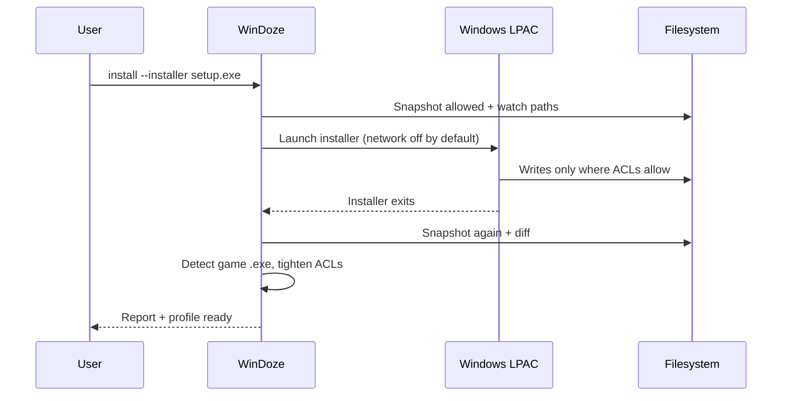

# Sandboxed Install (v0.2)

WinDoze v0.2 adds **`windoze install`** — run an untrusted installer inside LPAC, scan what it wrote, and block persistence outside the sandbox.

## Command

```powershell
windoze install `
  --id my-game `
  --name "My Game" `
  --install-dir "D:\Sandbox\MyGame" `
  --installer "D:\Downloads\setup.exe"
```

Or use the helper:

```powershell
.\tools\Install-GameSandbox.ps1 -Id my-game -Name "My Game" `
  -InstallDir "D:\Sandbox\MyGame" -Installer "D:\Downloads\setup.exe" -Launch
```

## What happens



### 1. Install-phase ACLs

The install directory gets **read/write/execute** so the installer can extract files. Save dir and `%ProgramData%\WinDoze\<id>\` are also writable.

### 2. Footprint snapshots

**Allowed roots** (writes expected):

- `--install-dir`
- Save directory
- `%ProgramData%\WinDoze\<id>\`

**Watch paths** (writes flagged as violations):

- Startup folders
- `%APPDATA%`, `%LOCALAPPDATA%`
- Desktop, Documents
- Start Menu / Programs
- `%ProgramData%` (outside the WinDoze profile subtree)

### 3. Sandboxed installer launch

The installer runs in LPAC with **network disabled by default** to reduce install-time phone-home. Use `--network` only if the installer requires it.

### 4. Post-install analysis

- Lists new/modified files under allowed roots
- Flags any new files under watch paths
- Marks **suspicious** paths (Startup, System32, Tasks, etc.)
- Auto-detects the game `.exe` (skips `setup.exe`, `unins*.exe`, etc.)
- Writes `%ProgramData%\WinDoze\<id>\install-report.json`

### 5. ACL tightening

By default, install dir ACLs are tightened to **read/execute** after a successful install so the game can run but not self-modify. Use `--keep-install-writable` to skip this (e.g. for games that patch themselves).

## Options

| Flag | Default | Purpose |
|---|---|---|
| `--installer-args` | empty | Arguments for the installer |
| `--executable` | auto-detect | Skip executable detection |
| `--allow-outside-writes` | off | Warn but don't fail on outside writes |
| `--keep-install-writable` | off | Keep install dir writable after install |
| `--network` | off | Allow network during install |

## Exit codes

| Code | Meaning |
|---|---|
| `0` | Install succeeded, no outside writes, executable detected |
| `1` | Installer failed, outside writes detected, or no executable found |

## Viewing the report

```powershell
windoze show-install-report --profile my-game
```

## Malware-focused workflow

1. **Never** install untrusted games outside WinDoze first
2. Run `windoze install` with network **off**
3. Review `install-report.json` — `outsideWrites` should be empty
4. If clean, enable `--network` on the profile later if the game needs online play:
   ```powershell
   # Edit profile JSON: "network": true, then:
   windoze grant --profile my-game
   ```
5. Launch: `windoze launch --profile my-game`

## Limitations (v0.2)

- Registry persistence is not yet scanned (filesystem only) — planned v0.3
- Watch-path scans can take time on large `%LOCALAPPDATA%` trees
- Installers that require admin elevation outside the sandbox may fail
- Some installers spawn external processes that are not sandboxed
